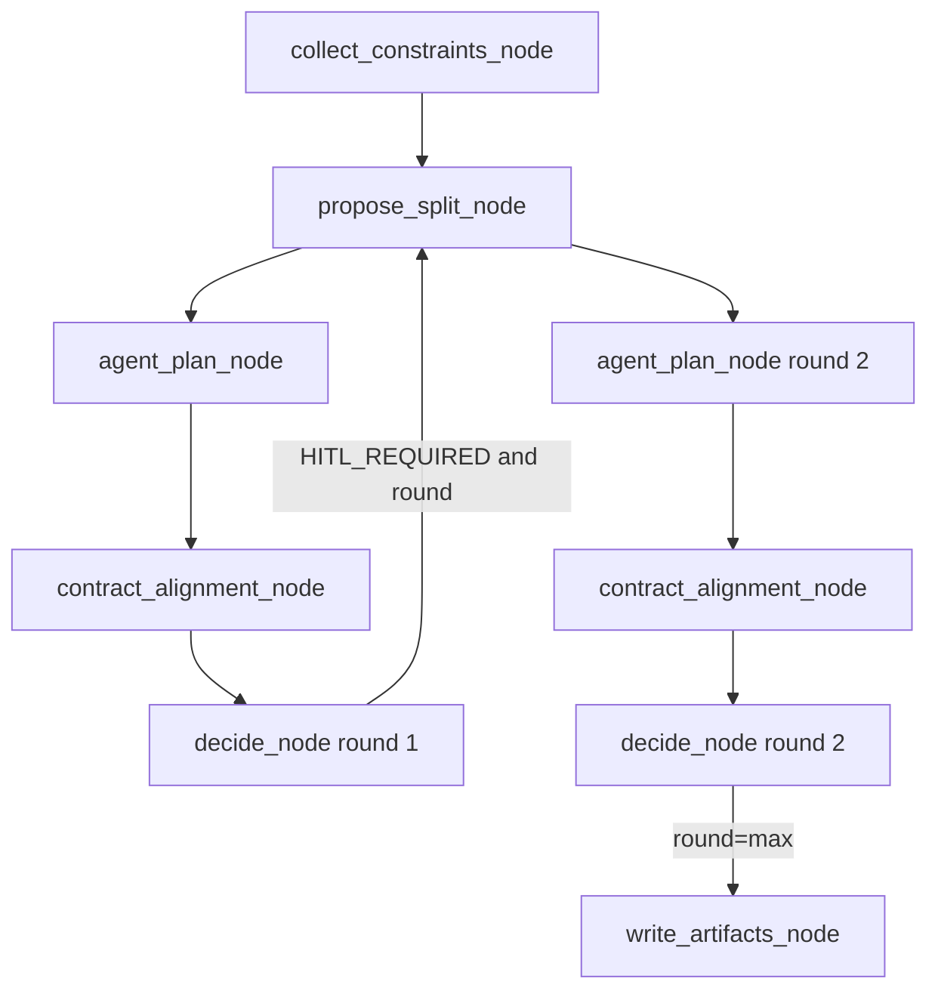
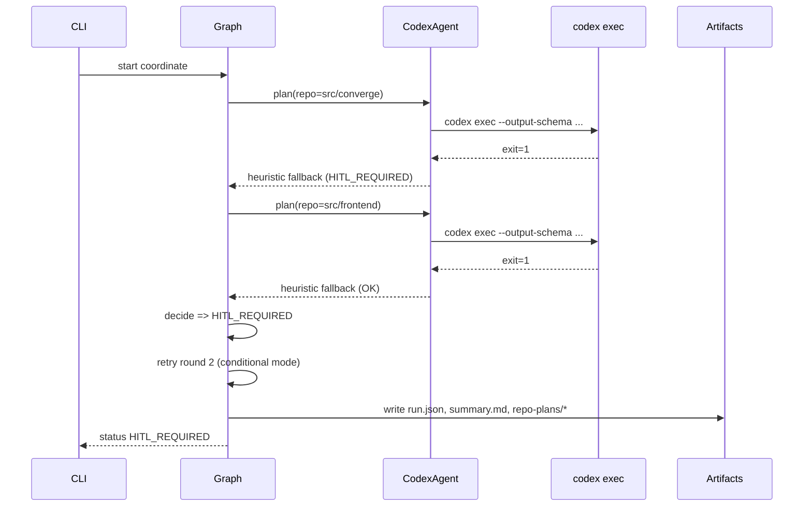

# Opik Trace Walkthrough (Codex Enabled): `019c4fcc-ba48-7e2e-b169-4b5c3f9f2a39`

This document explains a real `converge coordinate` run where Codex was enabled, but Codex planning failed and Converge fell back to heuristic plans.

## Run Context

- Command:

```bash
converge coordinate \
  --goal "Support for a modern, innovative and user friendly frontend ..." \
  --repos src/converge \
  --repos src/frontend \
  --max-rounds 2 \
  --hil-mode conditional
```

- Trace ID from runtime logs: `019c4fcc-ba48-7e2e-b169-4b5c3f9f2a39`
- Artifacts directory: `.converge/runs/20260212T030222995117Z`
- Final status: `HITL_REQUIRED`

## High-Level Timeline

1. `14:02:21` CLI starts, logging + Opik configured.
2. `14:03:57` Round 1 planning starts (`CodexAgent initialized (codex_enabled=True)`).
3. `14:04:13` Codex planning for `src/converge` fails (`exit=1`), fallback plan becomes `HITL_REQUIRED`.
4. `14:04:30` Codex planning for `src/frontend` fails (`exit=1`), fallback plan remains `OK`.
5. `14:06:32` Round 2 repeats same sequence due `conditional` mode and `max-rounds=2`.
6. `14:07:02` run ends `HITL_REQUIRED` and writes artifacts.

## Execution Diagram





## What Each Node Produced

### `collect_constraints_node`
Source: `.converge/runs/20260212T030222995117Z/constraints.json`

- `src/converge`: `repo_type=unknown`, `signals=[]`
- `src/frontend`: `repo_type=node`, `signals=["package.json"]`

Impact:
- `src/converge` being `unknown` caused heuristic plan ambiguity and a HITL question.

### `propose_split_node`
Source: `.converge/runs/20260212T030222995117Z/summary.md`

- Produced rationale + risk list for a modern frontend strategy.
- This stage succeeded; it was not the blocker.

### `agent_plan_node`
Source: `.converge/runs/20260212T030222995117Z/run.json`

- Provider: `codex`
- For both repos, `raw.execution_mode` = `heuristic` (fallback happened).
- `src/converge` plan status: `HITL_REQUIRED`
- `src/frontend` plan status: `OK`

### `contract_alignment_node`
Source: `.converge/runs/20260212T030222995117Z/contract-checks.md`

- `Artifacts: 0`
- `Issues: 0`

### `decide_node`
Source: `.converge/runs/20260212T030222995117Z/run.json` events

- Round 1: `status=HITL_REQUIRED`
- Round 2: `status=HITL_REQUIRED`
- Because max rounds reached, graph exits to artifact writing.

## Why Codex Planning Failed Despite Codex Being Enabled

The log line confirms config was active:

- `CodexAgent initialized (codex_enabled=True)`

But Codex planning still failed (`exit=1`) for both repos.

Important detail:
- Current warning log truncates stderr to first 300 chars, so you only see the Codex banner and not root cause text.

In a direct local repro with the same `codex exec` pattern, full stderr showed a session filesystem permission error under `~/.codex/sessions`.

## Stored Artifacts and "Packages" Check

From `.converge/runs/20260212T030222995117Z`:

- Core files: `run.json`, `summary.md`, `constraints.json`, `responsibility-matrix.md`, `contract-map.json`, `contract-checks.md`
- Prompt files: `prompts/converge_codex_prompt.txt`, `prompts/frontend_codex_prompt.txt`
- Repo handoff pack:
  - `repo-plans/converge/plan.md`
  - `repo-plans/converge/agent-prompt.txt`
  - `repo-plans/converge/commands.sh`
  - `repo-plans/frontend/plan.md`
  - `repo-plans/frontend/agent-prompt.txt`
  - `repo-plans/frontend/commands.sh`

Packages/dependency actions in this run:
- No package installation was executed by Converge.
- Only command hints were generated (for frontend: commented `npm install`, `npm test`, `npm run typecheck`, `npm run lint`).

## Opik Trace Retrieval Status

Attempted to fetch trace/spans for `019c4fcc-ba48-7e2e-b169-4b5c3f9f2a39` via Opik API client in this environment.

Result:
- Fetch failed with network DNS resolution error (`httpx.ConnectError: Temporary failure in name resolution`).
- So this document uses runtime logs + local run artifacts for analysis.

## Consistency Check Summary

What is consistent:
- `codex_enabled=True` is correctly reflected in logs.
- `conditional` mode correctly retries to round 2.
- Final `HITL_REQUIRED` matches repo-plan statuses.

What is inconsistent / misleading:
- Codex failure reason is obscured by stderr truncation.
- `src/converge` classification as `unknown` is due root-level marker detection only.

## Recommended Fixes

1. Improve failure visibility:
- Log a larger stderr tail for Codex failures.

2. Improve repo classification:
- Add fallback signals based on recursive file extension counts so `src/converge` can infer Python.

3. Keep handoff artifact naming provider-neutral:
- Continue using `agent-prompt.txt` as the canonical prompt handoff file.
